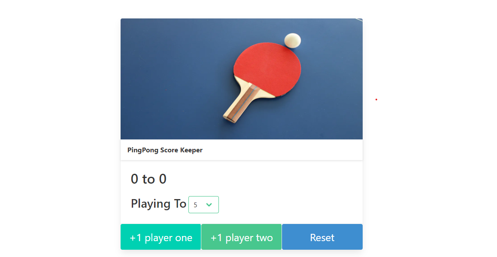

# Ping Pong Score Keeping Application - Web Bootcamp Project

This repository contains a Ping Pong Score Keeping Application that I built as part of Udemy's Web Development Bootcamp by Colt Steele. The application allows users to keep track of scores in a ping pong match and provides a simple and intuitive interface.

## Preview

## Live Site

[Link to Live Site](https://mbilal-x.github.io/web-bootcamp__Score-Keeping-App)

## Features

- Simple and user-friendly interface
- Score tracking for ping pong matches
- JavaScript for handling score updates
- Clear visual indicators for the current score
- Option to reset the score and start a new match

## Technologies Used

- HTML
- CSS (Bulma CSS)
- JavaScript

---
Feel free to explore the project, use it as a reference, and contribute to its improvement. If you have any questions or suggestions, please feel free to reach out. Happy coding! 😊
